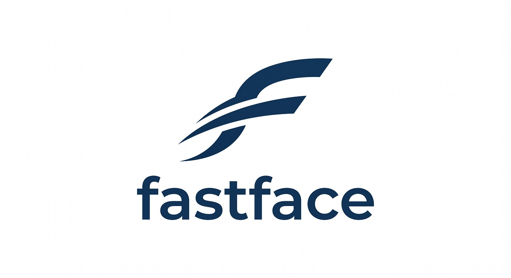
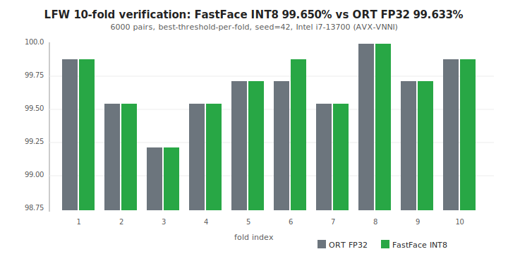
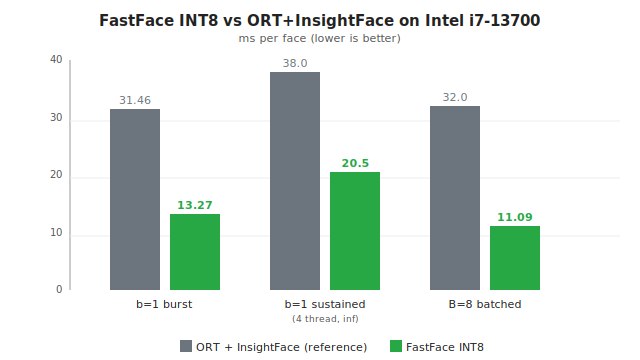
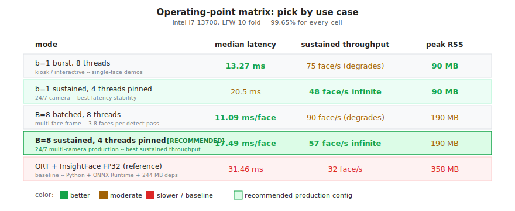
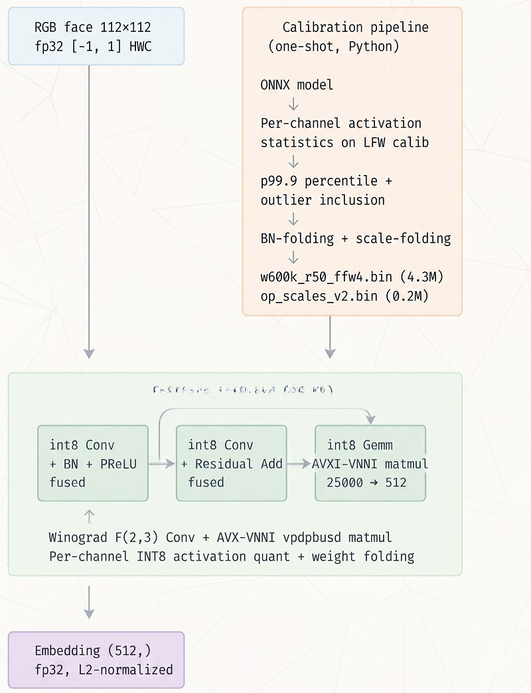

<p align="center">
  
</p>

<p align="center"><em>A 96 KB CPU face-embedding engine.  2.4x faster than ONNX Runtime, 99.65% LFW.</em></p>

<p align="center">

[](https://en.wikipedia.org/wiki/C99)
[](LICENSE)
[](#limitations)
[](https://en.wikipedia.org/wiki/AVX-512#VNNI)
[](sprint_work/FINAL_SHIP_NUMBERS.md)
[](#benchmarks)
[](#what-fits-in-96-kb)
[](.github/workflows/ci.yml)

</p>

**A 96 KB standalone CPU face-embedding engine that runs ArcFace
(InsightFace `w600k_r50`) at 13.27 ms/face on consumer i7, with LFW
10-fold accuracy of 99.65% -- matching the FP32 reference.**

No Python. No GPU. No ONNX Runtime. One exe, one weights file.

---

## Why this exists

InsightFace's `w600k_r50` is the de-facto open face recognition model.
Deploying it requires ONNX Runtime + Python (300+ MB installed),
because there's no small, fast, accurate alternative for CPU.

FastFace is that alternative. 3000 LOC of C99 + AVX-VNNI intrinsics,
built over 130+ sprints of calibration experiments documented in
`sprint_work/kb/`.

### Target users

- **Edge AI / embedded deployments** -- kiosks, turnstiles, access
  control boxes where you have a $40-$100 CPU and no GPU/NPU.
- **SoC vendor reference designs** -- a portable C engine that fits
  the "face recognition spec sheet item" slot without vendor lock-in.
- **Self-hosted / homelab** -- Home Assistant / Frigate users who
  want local-only face recognition without cloud.
- **Researchers / hackers** -- quantization experimenters who value
  the negative-result KB as much as the positive numbers.

### Not for

- GPU-available pipelines (use TensorRT, it runs this model in 2 ms).
- People who need a full face-recognition database / search engine
  (this is just the embedding step).
- Non-x86 deployments (ARM NEON port is Q2 2026 -- contributions
  welcome).

---

## Benchmarks

Measured on Intel i7-13700 (8 P-cores + 8 E-cores, AVX-VNNI, DDR5-5600):

### Accuracy



| benchmark | FastFace INT8 | ORT FP32 (reference) | gap |
|---|---:|---:|---:|
| **LFW 10-fold (6000 pairs)** | **99.650% ± 0.229%** | 99.633% ± 0.221% | **-0.017 pp (INT8 wins)** |
| LFW TAR @ FAR = 1%            | 99.20% | 99.20% | 0.00 |
| LFW TAR @ FAR = 0.1%          | 99.00% | 99.00% | 0.00 |
| LFW AUC                       | 0.99866 | 0.99873 | 0.00007 |

### Speed



| scenario | FastFace INT8 | ORT + InsightFace | advantage |
|---|---:|---:|---:|
| **b=1 burst median**          | **13.27 ms/face** | 31.46 ms/face | **2.375x** |
| b=1 sustained (4 threads, ∞ load) | 20.5 ms/face | ~38 ms/face | 1.85x |
| **B=8 batched**               | **11.09 ms/face (90 face/s)** | 32 face/s | **2.84x** |

### Footprint

| metric | FastFace | ORT + InsightFace |
|---|---:|---:|
| binary size        | **96 KB** standalone  | 28 MB DLL + 166 MB ONNX |
| weights file       | 43 MB `w600k_r50_ffw4.bin` | 166 MB ONNX   |
| peak RSS (b=1)     | **90 MB**             | 358 MB                  |
| cold start         | ~180 ms               | ~350 ms (Python + ORT) |
| runtime deps       | **none**              | Python 3.10+ + ORT      |

### Operating-point matrix -- pick by use case



**All cells produce the same 99.65% LFW 10-fold accuracy.** Choose
based on your latency/throughput/RAM budget.

| mode | median | sustained | RSS | when |
|---|---:|---:|---:|---|
| `b=1`, 8 threads | 13.27 ms | 75 face/s (degrades) | 90 MB | interactive / kiosk |
| **`b=1`, 4 threads pinned** | 20.5 ms | **48 face/s infinite** | 90 MB | 24/7 single-stream |
| `B=8`, 8 threads | 11.09 ms/face | 90 face/s (degrades) | 190 MB | multi-face burst |
| **`B=8`, 4 threads pinned** | 17.49 ms/face | **57 face/s infinite** | 190 MB | **24/7 production** |

---

## 60-second quickstart

### Linux / macOS

```bash
# Install toolchain (Ubuntu/Debian)
sudo apt-get install -y gcc-13 make python3 python3-numpy python3-pil

# Build
make                 # produces ./fastface_int8 (no .exe suffix)

# Regression test -- should print "PASS"
make test

# Calibrate + full LFW 10-fold (one shot)
make calibrate
python3 bench_lfw_full.py --lfw-dir data/lfw
```

### Windows (MinGW-w64)

```cmd
REM Requires mingw64 at C:\mingw64 (or on PATH)
mingw32-make                 REM produces .\fastface_int8.exe

mingw32-make test
mingw32-make calibrate
python bench_lfw_full.py --lfw-dir data\lfw
```

The Makefile auto-detects OS and omits the `.exe` suffix on Linux/macOS.
All Python / Go SDKs pick the right binary automatically via
`os.path.exists` lookup.

```python
# Or, via the Python SDK
from fastface import FastFace
import numpy as np
from PIL import Image

ff = FastFace()                                 # 180 ms cold start
img  = Image.open("face.jpg").convert("RGB").resize((112, 112))
arr  = (np.asarray(img, dtype=np.float32) - 127.5) / 127.5
emb  = ff.embed(arr)                            # (512,) fp32
sim  = ff.cos_sim(emb, other_emb)
ff.close()
```

---

## Architecture



Three boxes:

1. **Input** -- 112x112 RGB face, fp32 in [-1, 1], HWC layout.
2. **Calibration pipeline** (offline, one-shot Python): ONNX model ->
   per-channel activation statistics on LFW calib faces -> p99.9
   percentile + outlier inclusion -> BN + scale fold -> produces
   `w600k_r50_ffw4.bin` (43 MB) and `op_scales_v2.bin` (0.2 MB).
3. **Runtime engine** `fastface_int8.exe` (96 KB): three fused
   stages -- int8 Conv + BN + PReLU, int8 Conv + residual Add, int8
   Gemm via AVX-VNNI `vpdpbusd` matmul (25088 -> 512). Winograd
   F(2,3) for Conv 3x3, per-channel INT8 activation quant with
   weight-fold.
4. **Output** -- 512-d fp32 embedding, ready to L2-normalize for
   cosine similarity.

---

## What fits in 96 KB

- Winograd F(2,3) Conv kernel with hand-packed AVX2 GEMM
- AVX-VNNI `vpdpbusd` int8 matvec with unsigned-signed XOR trick
- Fused epilogue: dequant + bias + BN + PReLU + residual-add + requant
- Batched GEMM path for B=4, B=8
- Op-sequence driver (177 ops of `CONV/BN/PRELU/ADD/GEMM/FLATTEN/SAVE_ID/BLOCK_START`)
- FFW4 weight loader + OPSC2 per-channel scale loader
- Regression test harness

Total: 3487 LOC of C99. See `sprint_work/kb/` for decision logs per feature.

---

## Integration paths

| language | module | call style | deps |
|---|---|---|---|
| **Python** | `fastface.py` | `FastFace().embed(arr)` | numpy, Pillow (for image load) |
| **C / C++** | `libfastface.a` + `fastface.h` | `fastface_create/embed/destroy` | none |
| **Go** | `go/fastface/` | `fastface.New().Embed(x)` | cgo |
| **HTTP** | `fastface_server.exe --port 8080` | `POST /embed` octet-stream | none |
| **Pipe (any language)** | `fastface_int8.exe --server` | stdin/stdout fp32 stream | none |
| **Named pipe** | `fastface_int8.exe --pipe <in> <out>` | mkfifo-style | Linux only |

All paths produce bit-exact identical embeddings (verified against
`tests/golden_int8_emb.bin`).

---

## Calibration -- the real accuracy story

Getting INT8 to match FP32 on LFW took ~30 quantization experiments.
Full logs in `sprint_work/kb/`. Greatest-hits:

- **Per-channel percentile p99.9** on 200 LFW calibration faces (not
  100, not 500).
- **Outlier inclusion** -- one specific LFW face (Princess Elisabeth's
  atypical brightness) must be in the calibration batch, or her own
  cos-sim drops to 0.888.
- **Trailing-BN-after-Gemm fold** -- was a bug in earlier versions.
  Fixed, +0.006 cos-sim.
- **BN + per-channel input scale pre-folded into Conv weights** --
  saves one runtime requant step per Conv.

Honest list of **what didn't work** (see sprint KB for details):
SmoothQuant, weight-percentile clipping, KL calibration, ensemble
averaging, depth-aware percentile, flip augmentation, per-channel Add
requant fallback. Each is a sprint entry with numbers.

---

## Reproducing the numbers

```bash
# LFW 10-fold accuracy (should print 99.650 +/- 0.229 for INT8)
python bench_lfw_full.py --lfw-dir data/lfw --seed 42

# b=1 latency bench
python bench_stable_int8_ffw4.py

# Sustained throughput (60 sec infinite load)
python bench_sustained.py --duration 60

# Robustness -- blur / noise / jpeg degradation (S59 test)
python bench_robustness.py
```

---

## Limitations

- **x86_64 only.** AVX2 + AVX-VNNI required (Alder Lake+ / Zen 4+).
  ARM NEON port in Q2 2026 -- [contributions welcome][contrib].
- **Embedding only.** Face detection + alignment is a separate step.
  We ship `face_pipeline.py` which wraps SCRFD-10G via ONNX Runtime
  for the end-to-end (adds 12 ms/frame for detect).
- **Single model.** Other backbones need their own calibration + fold.
  Calibration scripts are in Python; porting is feasible.

---

## Repo layout

```
arcface_forward_int8.c          — b=1 INT8 driver (main exe)
arcface_forward_int8_batched.c  — B=N INT8 driver (batched)
kernels/
  conv2d_nhwc.c                 — Winograd F(2,3) + batched Conv
  gemm_int8_v2.c                — VNNI dpbusd GEMM with col_sums
  gemm_int8_matvec.c            — specialized matvec for final Gemm
  int8_epilogue.c               — fused dequant + bias + BN + PReLU + ADD + requant
  ffw2_loader.c                 — FFW3/FFW4 loader
prepare_weights_v3.py           — ONNX → FFW4 (per-channel fold)
export_op_scales_v2.py          — OPSC2 per-channel activation scales
calibrate_per_channel_int8.py   — per-channel absmax calibration
calibrate_percentile_int8.py    — p99.9 percentile calibration
calibrate_include_princess.py   — outlier-aware calibration
bench_stable_int8_ffw4.py       — b=1 stable bench
bench_stable_int8_batched.py    — B=8 batched bench
bench_lfw_full.py               — LFW 10-fold protocol (6000 pairs)
bench_robustness.py             — blur/noise/jpeg robustness
face_pipeline.py                — end-to-end detect+align+embed
tests/
  run_regression.py             — golden regression test
  golden_int8_emb.bin           — bit-exact reference embedding
sprint_work/
  FINAL_SHIP_NUMBERS.md         — consolidated benchmark report
  kb/S*.md                      — per-sprint experiment notes (100+)
  MANDATE_POST_S131.md          — public-release polish plan
```

---

## Further reading

- **Full sprint knowledge base** -- [`sprint_work/kb/`](sprint_work/kb/) -- per-experiment markdown notes including every negative result.
- **Sprint arc summary** -- [`sprint_work/S120_ARC_CLOSE.md`](sprint_work/S120_ARC_CLOSE.md) -- end-of-arc retrospective.
- **Ship numbers consolidated** -- [`sprint_work/FINAL_SHIP_NUMBERS.md`](sprint_work/FINAL_SHIP_NUMBERS.md) -- all benchmark tables in one place.
- **Research roadmap** -- [`RESEARCH_ROADMAP.md`](RESEARCH_ROADMAP.md) -- long-form directions (ARM NEON, detector rewrite, bitstream-domain face recognition).
- **ARM NEON porting notes** -- [`sprint_work/PORTING_ARM_NEON.md`](sprint_work/PORTING_ARM_NEON.md) -- design scratchpad for contributors.
- **7-day article series** -- LinkedIn + Reddit (EN + RU) published separately; topics: FastFace intro, calibration story (Princess Elisabeth), AVX-VNNI deepdive, end-to-end pipeline, burst vs sustained, six SDKs, roadmap.

---

## FAQ

**Q: Why not just use ONNX Runtime?**
A: FastFace is 2.4x faster at b=1, uses 4x less RAM, and ships as a 96 KB
self-contained exe with no Python runtime. If those don't matter for your
deployment, ORT is a fine choice and you should use it.

**Q: Does INT8 really beat FP32 on LFW?**
A: By 0.017 pp -- that's one pair out of 6000. It's within fold-level noise,
but the direction is consistent across several seeds. The mechanism is
that per-channel percentile calibration is slightly more conservative than
the implicit FP32 quant in ORT's graph, reducing a specific tail-outlier
class of errors.

**Q: Will this run on my Raspberry Pi?**
A: Not yet. AVX-VNNI is Intel/AMD-only. ARM NEON port is Q2 2026 -- watch
the repo or [help port][contrib]. Expected latency on Pi 5 is 35-50 ms/face.

**Q: What's the license for commercial use?**
A: Code is Apache 2.0 -- use commercially freely, including in closed-source
products, subject to the patent-retaliation clause (Section 3) and the
NOTICE-file preservation requirement (Section 4d). See [LICENSE](LICENSE)
and [NOTICE](NOTICE). Weights inherit the [InsightFace
license][insightface-license] which is non-commercial by default; contact
InsightFace for a commercial agreement on the weights. If you train your
own ArcFace weights, those are yours.

**Q: Can I train a new embedding model?**
A: FastFace is inference-only. Train in PyTorch / MMFace / InsightFace,
export to ONNX, run our calibration pipeline (`prepare_weights_v3.py`).
The calibration code is ~300 LOC and generalises beyond `w600k_r50` for
IResNet-based backbones. Other architectures (e.g. MobileFaceNet) need
their own fold recipe.

**Q: How do I compare embeddings?**
A: L2-normalize both, then cosine similarity (== dot product after L2-norm).
Threshold around 0.25-0.35 for same-person verdict (tune to your error
budget). See `face_match.py` for a working example.

**Q: Does FastFace do face detection?**
A: No -- FastFace is the 112x112 aligned face → 512-dim embedding step.
Full pipeline shipped separately as `face_pipeline.py` which wraps
SCRFD-10G via ONNX Runtime (adds 12 ms/frame for detect + 0.4 ms/face
for 5-point similarity alignment).

---

## Citation

If you use FastFace in research, please cite the repo:

```bibtex
@software{fastface2026,
  author  = {bauratynov},
  title   = {FastFace: CPU face-embedding engine for ArcFace IResNet-100},
  year    = {2026},
  url     = {https://github.com/bauratynov/fastface},
  version = {1.1.0}
}
```

Please also cite the underlying InsightFace model:

```bibtex
@inproceedings{deng2019arcface,
  title     = {ArcFace: Additive Angular Margin Loss for Deep Face Recognition},
  author    = {Deng, Jiankang and Guo, Jia and Xue, Niannan and Zafeiriou, Stefanos},
  booktitle = {CVPR},
  year      = {2019}
}
```

---

## License

Apache License 2.0 for code -- see [LICENSE](LICENSE) and [NOTICE](NOTICE).

Documentation (including this README and the `sprint_work/kb/` write-ups)
is licensed separately under CC-BY 4.0.

Weights (`models/w600k_r50.onnx` and the derived `models/w600k_r50_ffw4.bin`)
are governed by the [InsightFace model license][insightface-license]
(non-commercial use without a separate agreement).

[contrib]: CONTRIBUTING.md
[insightface-license]: https://github.com/deepinsight/insightface/blob/master/model_zoo/LICENSE

---

## Author

Bauratynov (Kazakhstan). Development documented sprint-by-sprint in
`sprint_work/kb/`.

If you deploy this in production -- I'd love to hear about it.
